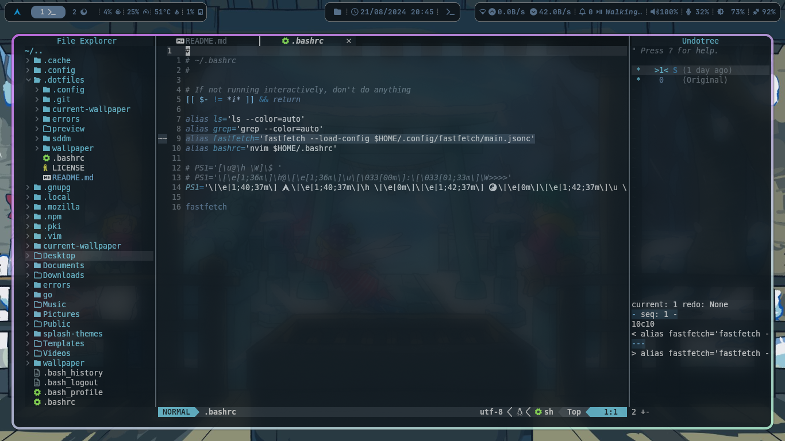
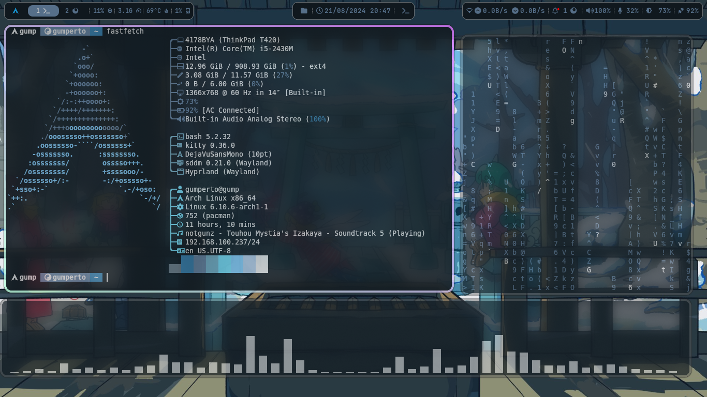
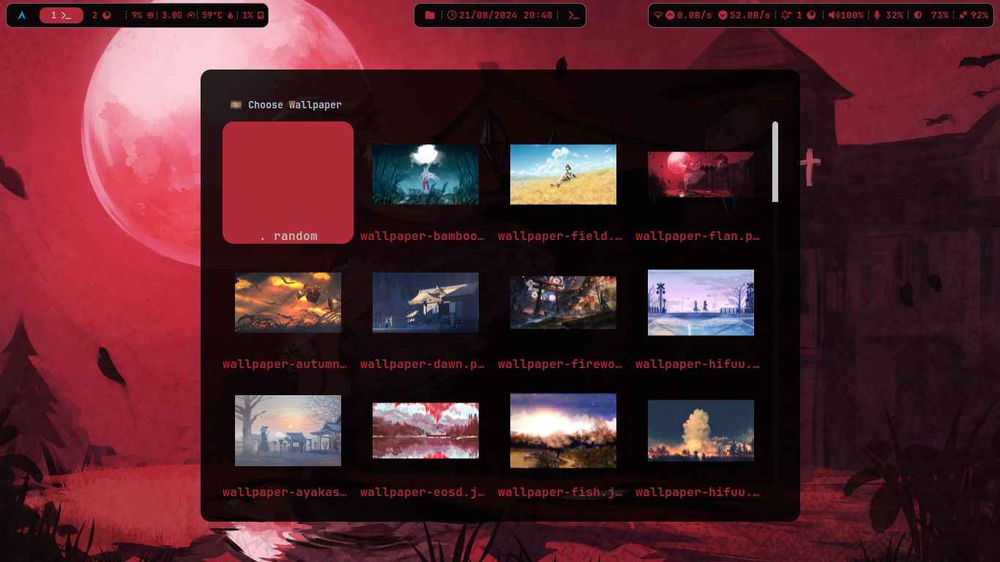
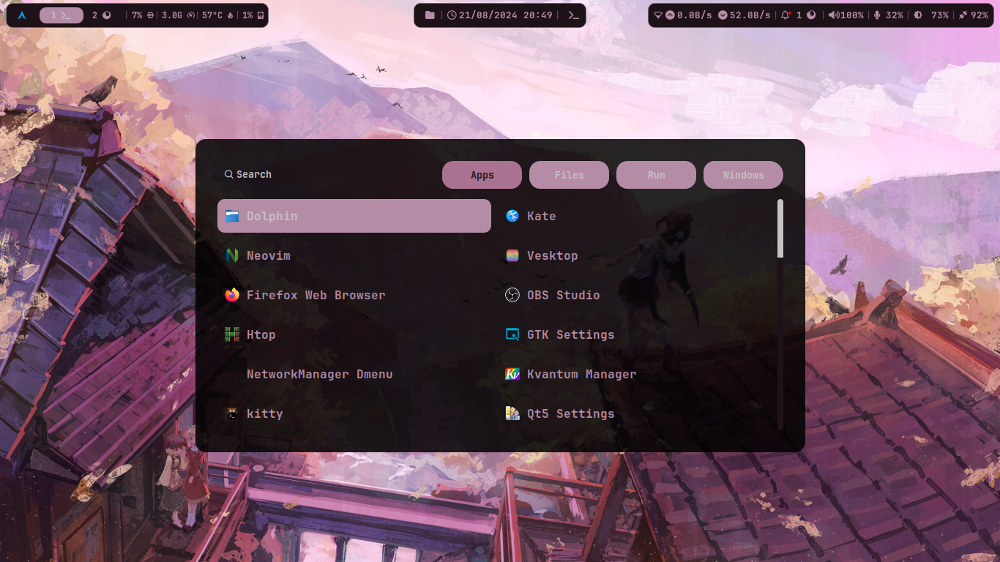
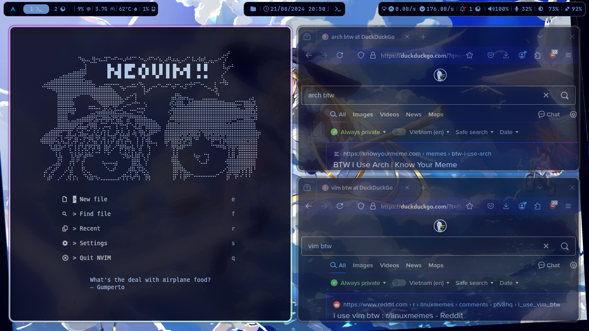

# Dotfiles
Collection of config files for my Arch Linux (btw) environment. They're mostly here for my own purposes of easy backup and control, but feel free to do what you want with them.

## Preview

|  |  |
|---|---|
|  |  |

## Cursor
Somewhere in these config files you'll find a custom Kirisame Marisa cursor I use, which could be found [here](https://store.kde.org/p/2165948).

## SDDM
The SDDM dots are shamelessly ripped and modified from [JaKooLit's](https://github.com/JaKooLit) fork of the [sddm-astronaut theme](https://github.com/Keyitdev/sddm-astronaut-theme), called [simple-sddm-2](https://github.com/JaKooLit/simple-sddm-2). I simply tweaked the QML script slightly so I can put a .gif in the background.
